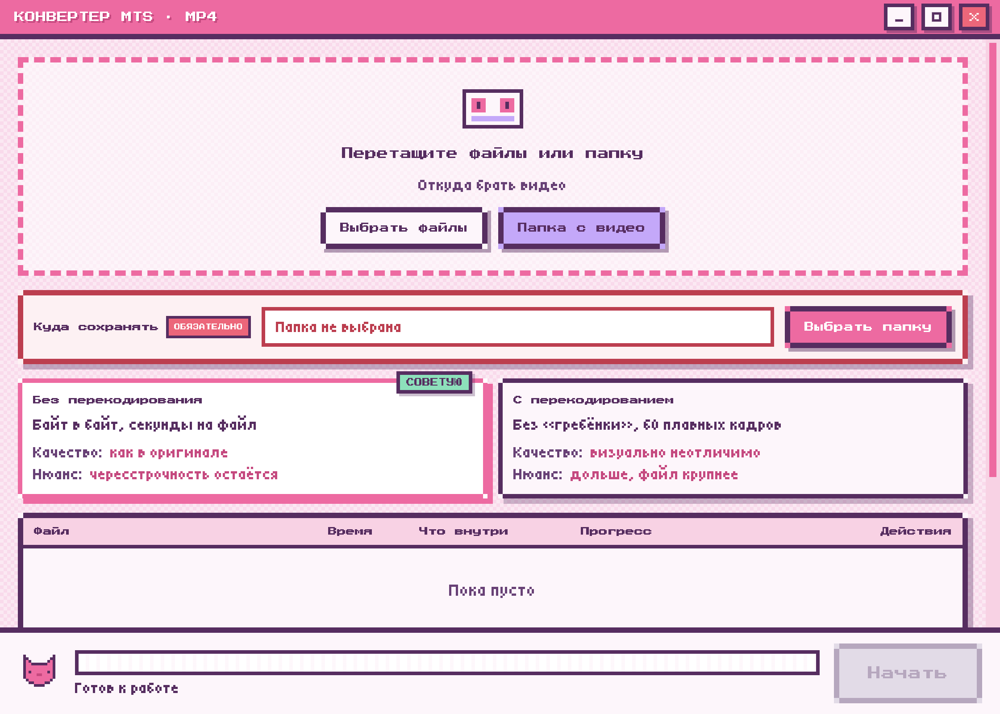

# MTS → MP4 Converter

<p align="center">
  
</p>

<p align="center">
  <strong>A small desktop app that batch-converts camera MTS/M2TS files to MP4.</strong><br>
  No command line. No separate FFmpeg install. Quality of picture and sound comes first.
</p>

<p align="center">
  <a href="README.ru.md">Russian</a> · English
</p>

<p align="center">
  
  
  
</p>

<p align="center">
  
</p>

The UI is bilingual. Switch **EN / RU** in the title bar. Russian is the default so a non-technical customer can use it as-is.

## Why

Camcorders write `.MTS` / `.M2TS`. Computers and phones open those files inconsistently, and online converters often re-encode “just in case”. This app looks inside the file first:

- if video and audio already fit in MP4, they are **copied byte for byte**;
- if the clip is interlaced or anamorphic, it is **rebuilt** so it looks right on a progressive display.

Camera originals are never modified. Finished MP4 files go into a folder you choose.

## Features

- Batch: individual files, a whole folder, or a camera card (walks into `BDMV/STREAM`)
- Two modes: **no re-encode** and **re-encode**
- Audio: original, AAC that plays everywhere, or both tracks
- Output folder is required — conversion will not start without it
- A repeat run asks whether to **replace** previous MP4s or **keep both**
- Cyrillic file names
- One-click Windows installer with a desktop shortcut; on Mac, drag into Applications

## Install

Builds are on [Releases](https://github.com/nstzholud/mts-converter/releases).

### Windows

1. Download `MTS-Converter-Setup-x.y.z.exe`
2. Run it — a shortcut appears on the desktop and in the Start menu
3. If SmartScreen warns about an unknown publisher: **More info → Run anyway**  
   There is no Microsoft signature. That is expected.

### macOS

1. Download `MTS-Converter-x.y.z-arm64.dmg` (Apple Silicon) or the `x64` build (Intel)
2. Open the disk image and drag the app into **Applications**
3. First launch macOS may say the app is **damaged**. It is not — there is no Apple Developer signature, so Gatekeeper blocks the download. Open **Terminal** and run both lines. After that the app starts:

```bash
xattr -cr "/Applications/MTS Converter.app"
open "/Applications/MTS Converter.app"
```

That is the working first-launch path. **System Settings → Privacy & Security → Open Anyway** is an alternative if you prefer not to use Terminal.

## How to use

1. Drop files or a folder, or press **Choose files** / **Folder of videos**
2. Set **Save to**
3. Keep the mode marked **SUGGESTED**, or pick the other one
4. Press **Start**

If the output folder already has files with the same names, the app asks whether to replace them or keep both (`video (2).mp4`).

You can leave Format settings alone. Safe defaults are already set. While a run is in progress they lock, so a file cannot be built half-old, half-new.

## Build from source

Needs Node.js 22+ and npm.

```bash
git clone https://github.com/nstzholud/mts-converter.git
cd mts-converter
npm ci
```

Download bundled FFmpeg once:

```bash
npm run vendor:mac
npm run vendor:mac -- --intel
npm run vendor:win
```

Development:

```bash
npm start
```

Installers:

```bash
npm run build:mac           # dist/MTS-Converter-1.0.3-arm64.dmg
npm run build:win           # dist/MTS-Converter-Setup-1.0.3.exe
```

A `v*` tag builds both installers in GitHub Actions: the Windows `.exe` and the macOS `.dmg` (Apple Silicon).

## Versioning

The version lives in `package.json` and matches the release tag.

| Version | Meaning |
| --- | --- |
| `1.0.0` | first public build |
| `1.0.1` | Windows CI installer actually builds |
| `1.0.2` | CI no longer fails on electron-builder’s implicit GitHub publish |
| `1.0.3` | tag builds both the Windows exe and the macOS dmg |
| tag `v1.0.3` | same number, prefixed with `v` — Releases and Actions key off this |

To ship the next one:

1. Bump `package.json`
2. Add a section in [CHANGELOG.md](CHANGELOG.md)
3. Commit, tag, push:

```bash
git tag -a v1.1.0 -m "v1.1.0"
git push origin main
git push origin v1.1.0
```

The tag builds both installers. An Intel Mac DMG is still local: `npm run build:mac -- --intel`.

## Layout

```
electron/     main process, queue, ffmpeg
renderer/     UI and translations (EN / RU)
scripts/      icon, FFmpeg download, packaging
vendor/       FFmpeg binaries (downloaded, not in git)
docs/         README screenshots
```

## License

Application source is [MIT](LICENSE).

Installers ship FFmpeg built with `--enable-gpl`. It runs as a separate process; the app does not link against it. GPL v2 and other notices are in [THIRD-PARTY-NOTICES.txt](THIRD-PARTY-NOTICES.txt).
